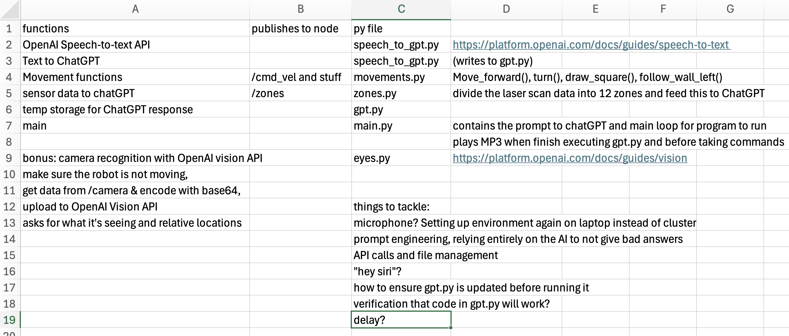

# juanito-bot
Juanito is a robot that can understand human speech and perform tasks depending on given instruction.

The name "Juanito" is a diminutive form of "Juan," which is the Spanish equivalent of "John" in English. It's commonly used in Spanish-speaking countries as an affectionate or casual form of Juan. The suffix "-ito" in Spanish often indicates a smaller or endearing version of something, so "Juanito" can be translated to "little Juan" or "dear Juan." The name is popular in Spain, Mexico, and other parts of Latin America.
